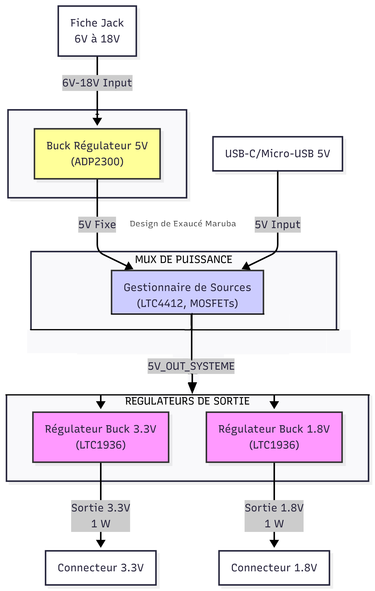

# Design d'une alimentation à double entrée (USB 5V / Jack 6-18V)

Ce dépôt héberge le rapport technique complet et les fichiers de simulation relatifs à la conception d'un module d'alimentation régulée à double source, destiné aux systèmes électroniques embarqués.

## 1. Vue d'ensemble du Projet

L'objectif principal du design est de créer une solution d'alimentation flexible et robuste, capable de commuter automatiquement entre deux sources d'entrée distinctes pour fournir des rails de tension stables et critiques ($3,3\,\text{V}$ et $1,8\,\text{V}$).

### Spécifications Fonctionnelles

| Paramètre | Spécification | Unité |
| :--- | :--- | :--- |
| **Entrée 1 (DC Jack)** | $6$ à $18$ | $\text{V}$ |
| **Entrée 2 (USB Type-C)** | $5$ | $\text{V}$ |
| **Sortie Régulée 1** | $3,3$ | $\text{V}$ |
| **Sortie Régulée 2** | $1,8$ | $\text{V}$ |
| **Puissance Totale Max.** | $2$ | $\text{W}$ |
| **Fonctionnalité Clé** | Commutation $\text{OR-ing}$ idéal | Sans perte, automatique |

---

## 2. Architecture de la Conception

La conception repose sur trois blocs fonctionnels principaux :

1.  **Gestion de l'Entrée (Power MUX) :** Utilisation d'un contrôleur de $\text{OR-ing}$ idéal ($\text{LTC}4412$) et de $\text{MOSFETs}$ pour sélectionner la source d'entrée la plus élevée sans l'inefficacité des diodes standard.
2.  **Bus 5V Stabilisé :** Création d'un bus intermédiaire stable de $5\,\text{V}$ à partir de la source d'entrée sélectionnée.
3.  **Régulations de Sortie :** Utilisation de convertisseurs $\text{Buck}$ haute performance ($\text{LT}1936$ et $\text{ADP}2300$) pour descendre la tension du bus $5\,\text{V}$ vers les rails $3,3\,\text{V}$ et $1,8\,\text{V}$.

## 3. Contenu du Dépôt

Ce dépôt fournit les ressources suivantes :

* **Rapport de Design ($\text{PDF}$) :** Détails des calculs de dimensionnement (inductances, condensateurs de compensation/filtrage), analyse des $\text{MOSFETs}$ et schémas d'application.
* **Fichiers LTSpice :** Schematics et netlists utilisés pour valider le rendement, le $\text{ripple}$ de sortie et les performances transitoires.
*   Liste complète des composants utilisés (incluant les références spécifiques et les valeurs).

---

 
## 5. Contact

Pour toute information technique ou académique concernant ce design (schémas, simulations, calculs de dimensionnement), veuillez contacter l'auteur principal :

| Détail | Information |
| :--- | :--- |
|  Exaucé MARUBA K. |
|  Université de Kinshasa (UNIKIN) |
|  Faculté Polytechnique |
|  Génie Électrique et Informatique, Option Électronique |
|  exauce.kambale@unikin.ac.cd |